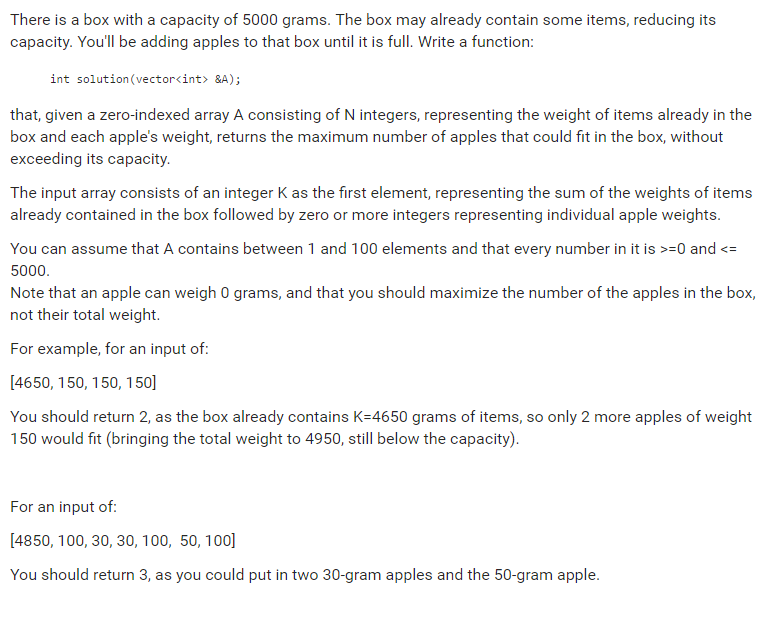

# Codility. Count Apples

### Codility

## Question



## Solution

* C++
```
#include <algorithm>

int countApples(vector<int> & A){
    int res = 0;
    sort(A.begin()+1, A.end());
    for(unsigned int i=1; i<A.size() && A[0]<=5000; ++i){
        A[0] += A[i];
        if(A[0] <= 5000) res++;
    }
    return res;
} 
```

## Explanation

Sort the apples by their weight.

Add apple to `A[0]` from the lightest apple to heavest apple, and count the apples.

If add an apple and the total weight is more than 5000, jump out and return the result.

* **worst-case time complexity:** `O(n*log(n))`
* **worst-case space complexity:** `O(log(n))`

## Test cases

* [0]  --> 0
* [5000] --> 0
* [5000, 0,0,0,0] --> 4
* [0,5000,0,1]    --> 2
* [4999, 1,1] --> 1
