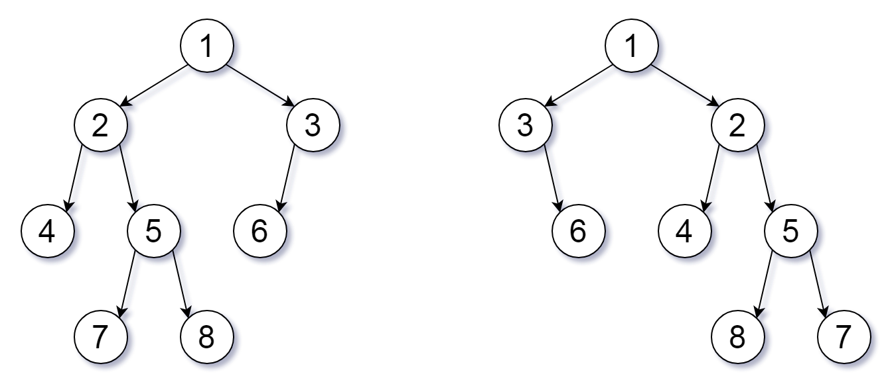

# LC951. Flip Equivalent Binary Trees

### LeetCode

## Question

For a binary tree T, we can define a flip operation as follows: choose any node, and swap the left and right child subtrees.

A binary tree X is flip equivalent to a binary tree Y if and only if we can make X equal to Y after some number of flip operations.

Write a function that determines whether two binary trees are flip equivalent. The trees are given by root nodes root1 and root2.

**Example 1:**
```
Input: root1 = [1,2,3,4,5,6,null,null,null,7,8], root2 = [1,3,2,null,6,4,5,null,null,null,null,8,7]
Output: true
Explanation: We flipped at nodes with values 1, 3, and 5.
Flipped Trees Diagram
```



**Note:**

* Each tree will have at most 100 nodes.
* Each value in each tree will be a unique integer in the range [0, 99].

## Solutions
* Scala1
```
def flipEquiv(root1: TreeNode, root2: TreeNode): Boolean = {
    if(root1==null && root2==null)  true
    else if(root1==null || root2==null)  false
    else if(root1.value != root2.value)  false
    else  flipEquiv(root1.left, root2.left) && flipEquiv(root1.right, root2.right) || flipEquiv(root1.left, root2.right) && flipEquiv(root1.right, root2.left)
}
```

## Explanation

Because each value in each tree will be a unique integer, we can compare the subtree of the two treese.

The case of non Flip Equivalent Binary Trees:

1. one node is null, but the node in the other tree is not null.
2. the values of the two nodes are different. 

* **worst-case time complexity:** `O(log(n))`, where `n` is the number of the nodes in the tree.
* **worst-case space complexity:** `O(log(n))`, where `n` is the number of the nodes in the tree.
