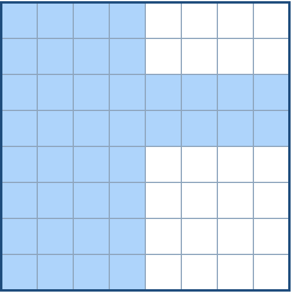

# LC427. Construct Quad Tree

### LeetCode

## Question

We want to use quad trees to store an `N x N` boolean grid. Each cell in the grid can only be true or false. The root node represents the whole grid. For each node, it will be subdivided into four children nodes until the values in the region it represents are all the same.

Each node has another two boolean attributes : isLeaf and val. isLeaf is true if and only if the node is a leaf node. The val attribute for a leaf node contains the value of the region it represents.

Your task is to use a quad tree to represent a given grid. The following example may help you understand the problem better:

Given the `8 x 8` grid below, we want to construct the corresponding quad tree:



It can be divided according to the definition above:


The corresponding quad tree should be as following, where each node is represented as a (isLeaf, val) pair.

For the non-leaf nodes, **val can be arbitrary**, so it is represented as *.


**Note:**

* N is less than 1000 and guaranteened to be a power of 2.
* If you want to know more about the quad tree, you can refer to its <a href="https://en.wikipedia.org/wiki/Quadtree">wiki</a>.

## Solutions

* C++1
```
class Solution {
public:
    bool allTheSame(vector<vector<int>>& grid, int width, int h, int w){
        for(int i=0; i<width; ++i){
            for(int j=0; j<width; ++j){
                if(  grid[h][w] != grid[h-width+i][w+j]
                  || grid[h][w] != grid[h+i][w-width+j]
                  || grid[h][w] != grid[h-width+i][w-width+j]
                  || grid[h][w] != grid[h+i][w+j])
                    return false;
            }
        }
        return true;
    }
    
    Node* construct(vector<vector<int>>& grid, int width, int i, int j) {
        if(width<=0 || allTheSame(grid, width, i, j)){
            return new Node(grid[i][j], true, NULL, NULL, NULL, NULL);
        } 
        int nextWidth = width/2;
        int minus = 0;
        if(nextWidth==0) minus = -1;
        Node* topLeft = construct(grid, nextWidth, i-nextWidth+minus, j-nextWidth+minus);
        Node* topRight = construct(grid, nextWidth, i-nextWidth+minus, j+nextWidth);
        Node* bottomLeft = construct(grid, nextWidth, i+nextWidth, j-nextWidth+minus);
        Node* bottomRight = construct(grid, nextWidth, i+nextWidth, j+nextWidth);
        return new Node(grid[i][j], false, topLeft, topRight, bottomLeft, bottomRight);
    }
    
    Node* construct(vector<vector<int>>& grid) {
        int mid = grid.size()/2;
        return construct(grid, mid, mid, mid);
    }
};
```

# Explanation

Find the middle point and the radius of each quad. Recursive into each quad.

* **worst-case time complexity:** O(n<sup>2</sup>), where n is the width of the grid.
* **worst-case space complexity:** O(log(n)), where n is the width of the grid.
