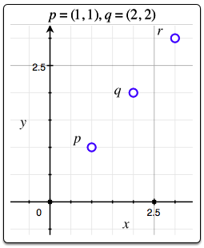

# Find the Point 

### HackerRank

## Question

Consider two points, P = (Px, Py) and Q = (Qx, Qy). We consider the inversion or point reflection, R = (Rx, Ry) , of point P across point Q to be a 180o rotation of point P around Q.

Given  sets of points P and Q, find R for each pair of points and print two space-separated integers denoting the respective values of Rx and Ry on a new line.

**Input Format**

The first line contains an integer, , denoting the number of sets of points. 
Each of the  subsequent lines contains four space-separated integers describing the respective values of Px, Py, Qx, Qy defining points P = (Px, Py) and Q = (Qx, Qy).

**Constraints**
* 1<= n <= 15
* -100 <= Px, Py, Qx, Qy <= 100
* 
**Output Format**
For each pair of points  and , print the corresponding respective values of  and  as two space-separated integers on a new line.

**Sample Input**
2
0 0 1 1
1 1 2 2

**Sample Output**
2 2
3 3

**Explanation**
The graphs below depict points P, Q, and R for the n=2  points given as Sample 

**Input:**

Thus, we print  `Rx` and `Ry`  as 2 2 on a new line.

Thus, we print `Rx` and `Ry`  as 3 3 on a new line.

## Solutions
* C++1
```bash
int main() {
    /* Enter your code here. Read input from STDIN. Print output to STDOUT */   
    int n;
    int p[4];
    cin >> n;
    for(int i=0; i<n; ++i) {
        for(int j=0; j<4; ++j)
           cin >> p[j];
        cout << to_string(p[2]*2 - p[0]) + " " + to_string(p[3]*2 - p[1]) << endl;
    }
    return 0;
}
```

* Java1
```bash
public static void main(String[] args) {
        /* Enter your code here. Read input from STDIN. Print output to STDOUT. Your class should be named Solution. */
        Scanner sc = new Scanner(System.in);
        int n = sc.nextInt();
        int [] p = new int[4];
        for(int i=0; i<n && sc.hasNextInt(); ++i) {
            for(int j=0; j<4; ++j)
                p[j] = sc.nextInt();
            int x = p[2]*2 - p[0];
            int y = p[3]*2 - p[1];
            System.out.println(x+" "+y);
        }
    }
```
